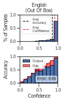
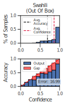
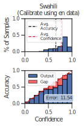
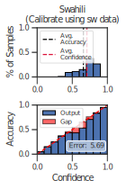

# MMLMCalibration

<h2 align="center">
  Official Code for the paper: "On the Calibration of Massively Multilingual Language Models"
</h2>

<p align="center">
  <a href="https://2022.emnlp.org/"></a>
  <a href="https://github.com/microsoft/MMLMCalibration/blob/main/LICENSE">
    
  </a>
</p>


Massively Multilingual Language Models (MMLMs) have recently gained popularity due to their surprising effectiveness in cross-lingual transfer. While there has been much work in evaluating these models for their performance on a variety of tasks and languages, little attention has been paid on how well calibrated these models are with respect to the confidence in their predictions. We first investigate the calibration of MMLMs in the zero-shot setting and observe a clear case of miscalibration in low-resource languages or those which are typologically diverse from English. Next, we empirically show that calibration methods like temperature scaling and label smoothing do reasonably well towards improving calibration in the zero-shot scenario. We also find that few-shot examples in the language can further help reduce the calibration errors, often substantially. Overall, our work contributes towards building more reliable multilingual models by highlighting the issue of their miscalibration, understanding what language and model specific factors influence it, and pointing out the strategies to improve the same.

<p float="center">
  
  
  
  
</p>


#### Dependencies
- Compatible with Python3.7
- The necessary packages can be install through requirements.txt.

#### Setup
Install VirtualEnv using the following (optional):

```shell
$ [sudo] pip install virtualenv
```
We recommend creating a virtual environment(optional):

```shell
$ virtualenv -p python3 venv
$ source venv/bin/activate
```
Finally, install the required packages by running:

```shell
pip install -r requirements.txt
```

#### Datasets

Download XNLI and PAWS-X datasets from the [link](https://drive.google.com/file/d/14hkXccY8bWUN_po2hQ699QgdYJJ_qSuO/view?usp=sharing) and place them in `data/` directory. There is no need of downloading XCOPA, COPA and SIQA datasets, they are loaded using Hugging Face's [datasets library](https://huggingface.co/docs/datasets/index). MARC dataset should be downloaded from [here](https://registry.opendata.aws/amazon-reviews-ml/) and pasted into `data/` directory.

#### Running Experiments

For vanilla fine-tuning of mBERT on XNLI and measuring calibration across lanaguages run
```
python -m src.run_sentence_cls \
    --mmlm bert-base-multilingual-uncased \
    --dataset xnli \
    --lr 3e-5 \
    --num_epochs 3 \
    --max_train_samples 40000
```

To run with label smoothing (LS)
```
python -m src.run_sentence_cls \
    --mmlm bert-base-multilingual-uncased \
    --dataset xnli \
    --lr 3e-5 \
    --num_epochs 3 \
    --max_train_samples 40000 \
    --alpha_smoothing 0.1
```

Running Label Smoothing + Temperature Scaling (LS + TS)
```
python -m src.run_sentence_cls \
    --mmlm bert-base-multilingual-uncased \
    --dataset xnli \
    --lr 3e-5 \
    --num_epochs 3 \
    --max_train_samples 40000 \
    --alpha_smoothing 0.1 \
    --temp_scaling \
    --cal_lang en \
    --cal_size 500
```

Other examples can be found in [`scripts/experiments_xnli.sh`](scripts/experiments_xnli.sh) and [`scripts/experiments_xcopa.sh`](scripts/experiments_xcopa.sh)

## Contributing

This project welcomes contributions and suggestions.  Most contributions require you to agree to a
Contributor License Agreement (CLA) declaring that you have the right to, and actually do, grant us
the rights to use your contribution. For details, visit https://cla.opensource.microsoft.com.

When you submit a pull request, a CLA bot will automatically determine whether you need to provide
a CLA and decorate the PR appropriately (e.g., status check, comment). Simply follow the instructions
provided by the bot. You will only need to do this once across all repos using our CLA.

This project has adopted the [Microsoft Open Source Code of Conduct](https://opensource.microsoft.com/codeofconduct/).
For more information see the [Code of Conduct FAQ](https://opensource.microsoft.com/codeofconduct/faq/) or
contact [opencode@microsoft.com](mailto:opencode@microsoft.com) with any additional questions or comments.
